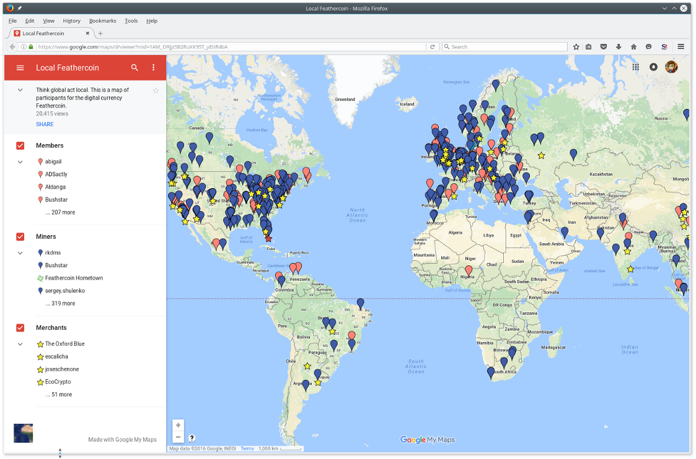

# Feathercoin Wallet - Meta data

## What is Feathercoin?

#### Who owns Feathercoin?

Feathercoin is a cryptographic based currency using the Bitcoin core protocols and it's own settings. Feathercoin runs as a blockchain on a peer to peer network. The software to validate and access the Feathercoin blockchain is developed by a group of open source contributors communicating through the Feathercoin forum. 

#### Community development

Community involvement has been part of the Feathercoin philosophy from it's initiation by Peter Bushnell when he created the Feathercoin forum. In particular to produce guides and support for new users and developers in the forum. [Ref 2]  

The Feathercoin forum is already well established with answers to common questions and if you can't find in the answer in the guide then community support is available there. The Feathercoin forum is moderated and has guidelines to keep it respectful. [Ref 6]

#### Help or Support

If you wish to help or give support which can be as easy as becoming a forum  member and up voting a good post to becoming a moderator or helping develop or test new enhancements. 

The forum also contains threads of members experience, guides and details on developing external projects like starting a pool or developing a new app, exchange, web site or other novel use case. Once you post a "hello" message in New Users, you can post on the forum.   

Once you are a forum member, You can increases your reputation by giving and receiving kudos,  by clicking the arrows on the bottom right of the posts. [Ref 7]

#### Privacy

Privacy is a core feature of the Bitcoin Blockchain Feathercoin is forked from and complies by. [Ref 8]

#### The aims of the Feathercoin Wallet Guide

Feathercoin Wallet guide aims to show how to use the features of the Feathercoin Wallet and other relevant technology. 

#### Origin of the Screen shots

The information contained is based on Feathercoin wallet version 0.9.6. The guide is applicable to other Feathercoin-qt versions and other alternative currency wallets, such as Bitcoin or Litecoin, which have similar features and operations.

## Feathercoin (FTC) Core Wallet Features Overview

### Main Features   
* Send and Receive Feathercoins to an Address, a Stealth Address, URI text document or graphical QRCode.  
* View and filter historical Feathercoin Transactions.    
* Connect to a the Feathercoin Peer to  Peer network and update the Blockchain information.  
* Sign and Verify a message given, so as to prove ownership.
* Back-up your wallet data.
  

### Advanced Features   
* Multiple Signature Transactions  
* Add a text comment to the transaction  
* Include a Openname DNS (Dynamic Name server) addresses to the Blockchain   
* Create, manage and search for Stealth Addresses   
* Transaction reports  
* Coin Control 
* Print a Paper Wallet

### Plugins   
* Bitmessage  
* Shapeshift  
* Coinnector  

### Operational Features 
* Neoscrypt mining algorithm
* Automatic check pointing (ACP)
* enhanced Hash Rate Compensation (eHRC)

<!-- START doctoc generated TOC please keep comment here to allow auto update -->
<!-- DON'T EDIT THIS SECTION, INSTEAD RE-RUN doctoc TO UPDATE -->
**Table of Contents**  

- [Welcome to Feathercoin core wallet](#welcome-to-feathercoin-core-wallet)
  - [Introduction to Feathercoin Core](#introduction-to-feathercoin-core)
- [Feathercoin Wallet Main Screen and Buttons](#feathercoin-wallet-main-screen-and-buttons)
- [Feathercoin Wallet Buttons Bar](#feathercoin-wallet-buttons-bar)
  - [Hiding the Button Bar](#hiding-the-button-bar)
  - [Overview Button](#overview-button)
  - [Receive Button](#receive-button)
  - [Send Button](#send-button)
  - [Transaction Button](#transaction-button)
  - [Report Button](#report-button)
  - [MultiSig Button](#multisig-button)
- [Feathercoin Wallet Main Menu Options](#feathercoin-wallet-main-menu-options)
  - [Wallet drop down menu**](#wallet-drop-down-menu)
    - [Import URI payments](#import-uri-payments)
  - [Backup wallet data](#backup-wallet-data)
  - [Paper Wallet Menu](#paper-wallet-menu)
    - [Print a paper wallet](#print-a-paper-wallet)
    - [Import a Paper Wallet address](#import-a-paper-wallet-address)
  - [Encrypt your wallet](#encrypt-your-wallet)
  - [Receive Addresses Menu Option](#receive-addresses-menu-option)
    - [Receive currency and Manage Addresses](#receive-currency-and-manage-addresses)
  - [Send Addresses Menu Option](#send-addresses-menu-option)
    - [Stealth Addresses](#stealth-addresses)
  - [Exit](#exit)
- [Feathercoin wallet Settings Menu Options](#feathercoin-wallet-settings-menu-options)
  - [Settings drop down Menu](#settings-drop-down-menu)
  - [Options Menu](#options-menu)
    - [Options menu :  Main Tab](#options-menu---main-tab)
    - [Options menu :  Wallet Tab](#options-menu---wallet-tab)
  - [Options Tabs](#options-tabs)
    - [Network Tab](#network-tab)
    - [Windows Tab](#windows-tab)
    - [Display Tab](#display-tab)
  - [Sign or Verify a Feathercoin Address](#sign-or-verify-a-feathercoin-address)
    - [Sign a message](#sign-a-message)
    - [Verify a message](#verify-a-message)
  - [Debug console](#debug-console)
- [Feathercoin wallet Advanced Options Menu](#feathercoin-wallet-advanced-options-menu)
  - [Report and MultiSig Switch Main View](#report-and-multisig-switch-main-view)
  - [Comments in the Feathercoin Blockchain](#comments-in-the-feathercoin-blockchain)
    - [Write comments into the Feathercoin Blockchain](#write-comments-into-the-feathercoin-blockchain)
    - [Read comments from the Feathercoin Blockchain](#read-comments-from-the-feathercoin-blockchain)
- [Feathercoin wallet Plugins Menu](#feathercoin-wallet-plugins-menu)
  - [BitMessage encrypted peer to peer private messaging](#bitmessage-encrypted-peer-to-peer-private-messaging)
  - [Opennames DNS Service](#opennames-dns-service)
  - [Shapeshift service](#shapeshift-service)
  - [Coinnector service](#coinnector-service)
  - [Multiple Signature Addresses](#multiple-signature-addresses)
    - [Creating a Multiple Signature Address](#creating-a-multiple-signature-address)
    - [Spending from a Multiple Signature Address](#spending-from-a-multiple-signature-address)
- [Feathercoin Help Menu](#feathercoin-help-menu)
  - [Command line options](#command-line-options)
  - [Stealth transaction Search - SX Tool](#stealth-transaction-search---sx-tool)
- [Feathercoin Introduction to the Blockchain](#feathercoin-introduction-to-the-blockchain)
- [Feathercoin Back-end Features & Specification](#feathercoin-back-end-features-&-specification)
  - [enhanced Hash Rate Compensation (eHRC)](#enhanced-hash-rate-compensation-ehrc)
  - [Neoscrypt](#neoscrypt)
    - [NSGminer](#nsgminer)
    - [SGminer](#sgminer)
  - [Mining Pools](#mining-pools)
    - [Feathercoin P2Pool](#feathercoin-p2pool)
  - [Advanced Checkpointing (ACP)](#advanced-checkpointing-acp)
- [Links, External features and further information](#links-external-features-and-further-information)
  - [Feathercoin Android / Mobile wallet](#feathercoin-android--mobile-wallet)
  - [Feathercoin forum : find support for wallet issues](#feathercoin-forum--find-support-for-wallet-issues)
  - [Feathercoin forum : find support mining issues](#feathercoin-forum--find-support-mining-issues)
  - [Feathercoin : Online Block Explorers](#feathercoin--online-block-explorers)
  - [ftc-abe - Run your own Feathercoin Block Explorer](#ftc-abe---run-your-own-feathercoin-block-explorer)
  - [Feathercoin API](#feathercoin-api)
  - [pchMessageStart :  Using Feathercoin on a server with other Cryptographic currencies](#pchmessagestart---using-feathercoin-on-a-server-with-other-cryptographic-currencies)
  - [Feathercoin Graphics and Logos](#feathercoin-graphics-and-logos)
  - [Feathercoin Merchant tools](#feathercoin-merchant-tools)
  - [Feathercoin Online QR Code Generator](#feathercoin-online-qr-code-generator)
  - [Feathercoin Open Merchant Map](#feathercoin-open-merchant-map)
  - [FeatherPay - Feathercoin Point of Sales (POS)](#featherpay---feathercoin-point-of-sales-pos)
  - [Broadcast Transaction Service](#broadcast-transaction-service)
  - [Feathercoin Shopping Cart](#feathercoin-shopping-cart)
  - [Feathercoin (FTC) Opensource ATM](#feathercoin-ftc-opensource-atm)
  - [Feather Address - Client-Side Feathercoin Wallet Generator](#feather-address---client-side-feathercoin-wallet-generator)
  - [Web based Paper wallet Vanity address generators](#web-based-paper-wallet-vanity-address-generators)
  - [Self Notary process using the Feathercoin blockchain](#self-notary-process-using-the-feathercoin-blockchain)
  - [Feathercoin Local](#feathercoin-local)
  - [Feathercoin Technical settings](#feathercoin-technical-settings)
- [References / Further reading :](#references--further-reading-)
- [Post Scrypt](#post-scrypt)

<!-- END doctoc generated TOC please keep comment here to allow auto update -->

# Welcome to Feathercoin core wallet   

 

## Introduction to Feathercoin Core   

#### Currency & Transactions

One use of currency / money is to facilitate trade. Trade is recorded in bookkeeping, this information is traditionally closed to the public and requires third parties or middlemen to approve the transactions.

Cryptocurrency is digital form of currency that is being used increasingly all over the world because it has been designed to be used on the internet. Currencies like Feathercoin are based on open source code and a distributed security model; which means anyone can mine or produce the coins or contribute to the code and development. [Ref 1] 

#### Who runs the servers?

Cryptocurrency tries to take the validation out of the hands of centralised middlemen and allows anyone to participate. Agreeing on the software that controls the system being the consensus that is agreed prior to transactions taking place. Cryptocurrencies and the blockchain they are based on, is a groundbreaking internet technology of which "currency" is merely one of the possible applications.

#### Wallet

Cryptographic currency wallets are like a normal wallet but for "internet money" or "internet cash". The wallets have a complex job to do validating that your currency isn't counterfeit. They have been also designed to be intuitive to use and allow new users to get started without having to understands the technical details of how it operates "under the hood". 

The wallet acts as like a book keeper does, storing all incoming and out going expenses in a ledger. 

#### What makes up a cryptocurrency wallet?

When you download a wallet it includes the two parts, a ledger or blockchain containing information on transactions going to and from an address. It also contains software to initiate and check transactions on the system are within the validation rules, i.e. do the bookkeeping. 

Feathercoin is a long established blockchain [Ref 2] with a reputable open development and Bitcoin / Satoshi community ideal. The most extreme example of which is successfully hard forking the Feathercoin blockchain to an ASIC resistant hashing algorithm (Neoscrypt). 

**Official Wallet Downloads :** [Feathercoin Wallet Download](https://www.feathercoin.com/#dls)

# Feathercoin Wallet Main Screen and Buttons   

#### How do I use the Feathercoin wallet? 

The wallet main screen contains three parts, the menus, the buttons and the wallet overview.  

The menus contain a large number of features whereas the buttons have been chosen to represent the basic operation of the wallet that most people will need to perform.  Each screen is specialised for a task and is activated by pressing the appropriate button.

# Feathercoin Wallet Buttons Bar  

## Hiding the Button Bar

The button bar menu can be closed to make more room. If you need to activate the buttons or close the button menu then :  

Right click with your mouse on the button menu on the buttons menu to show the Tabs Toolbar check-box to close the button toolbar.  

## Overview Button

The overview page is self explanatory, the left side showing the current overall balance and on the right the most recent transactions that have occurred.  

#### Blockchain synchronisation

The first time the wallet is run, or if it has been offline for a while, it will need to synchronise or get up to date with the latest blockchain. As the wallet finds other wallets or peers on the feathercoin network, it will ask them for previous blocks and gradually build up a copy of the block chain.

 

#### Blockchain & Wallet storage

The blockchain is stored in the hidden .feathercoin directory or %Applications% in Windows. Because space can be limited, especially with SSDs, it is now possible to designate another disk to store the blockchain. 

Remember your wallet (wallet.dat) file is also stored with the Blockchain, so don't use USB flash memory drives or other removable drives for large transaction, live, because the chance of it failing before a backup is made after sending a transaction is greater. If the USB Flash drive / wallet is lost with no "immediate" backup after a send, the currency is on the Flash drive is lost. 

#### Wallet - Network Connection & Blockchain Synchronising icons

At the bottom right corner of the wallet window is the circular animation which shows the speed blocks are arriving. If you mouse over it will tell you how many blocks it has got to go and how long ago the last transaction was it has got to. When the sync is completed, you will see a tick. 

The triangle to the left of the tick, shows the "strength" of the peer to peer signal. It gradually fills "bars" till you get over 10 connections.

 

## Receive Button   

In order to receive funds you need to create a receive address, The label, message and request amount are optional, press request payment and the address is created.

In this case the invoice is for :  

Amount: 22.00 FTC  
Label: This is an invoice for the payment
Message: There's no hurry the end of the month will be fine.

  

#### Displaying the QRCode & Receive address details

A pop up is shown with the newly created receive address address and QRCode image.  The amount is shown, the Label (retained in wallet) and message.  

You can save and display the QR image, which can be scanned in on a phone wallet or using the in built wallet QR scanner. 

The URI text can also be saved to include the full information in a file, which can be sent as an attachment. 

  

#### Create a Stealth Address

**Stealth Addresses :**  

To create a stealth address you need to use the **Wallet -> Receive Addresses Menu option**, which includes additional features such as setting Stealth Address. 

## Send Button   

#### Getting the Receive address

In order to send funds you need to input the receivers address. You can label the transaction with a description and input the amount.  

Once you are happy you can press the send button and that transaction is sent to the blockchain. If you have the QR code of the Send address press send to QR code button will activate a camera snapshot and import of the QRCode.   

Press on the Add recipient button to send payments to more than one recipients.  

  

#### Scanning a QRCode off a web site or screen image

To use the QR scan feature, click "Send to QR". Then, position the scan box over the image. Press snap button to decode the QRCode or cancel to exit.  

  

## Transaction Button

The transaction button shows the transactions that have taken place. You will need to receive some coins to start with but after that reviewing transactions will be the most common place to go.  

  

#### Filtering Transactions

When you have a lot of transactions you can use the filters bellow the buttons to restrict which ones are shown, by time period,  search for recipients / senders or a specific address.  

Right click on the transactions to show the transaction drop down. In this case copy address to clipboard is highlighted so you simply paste that into a document for someone to send funds to that address without having to remember a large address.

Press the export button at the bottom right and export the transaction details to comma delimited file.

**Tip :** The filter conditions in place are shown at the bottom left of the window.  It is useful to know the filter conditions, e.g. If you've filtered out all your FTC and wondered where it all went ..  

 

## Report Button  

This image shows the grid shown when the report button is pressed. In the example the grid is filtered on "all the transactions that happened today" and calculates the number and total. 

#### Exporting to csv file

The filtered list can then be exported to a csv file the "Export" button at the bottom right of the window.   

  

## MultiSig Button  

MultiSig stands for multiple signature addresses.  Signature addresses can be made with up to three signatures with the current wallet implementation. Further details and an example of how to set up and use a MultiSig address is included later in the guide,  under menu options.

  

# Feathercoin Wallet Main Menu Options      

## Wallet drop down menu**   

The drop down menu allows access to URI dialog, wallet backup, Printing Paper Wallets, Putting a password on the wallet and editing it, locking the wallet, Addresses transactions are to be sent from and addresses transactions are in to. The final option is exit (with backup reminder).
 
   

### Import URI payments

#### Open URI menu

In information technology, a Uniform Resource Identifier (URI) is a string of characters used to identify a resource. Such identification enables interaction with representations of the resource over a network, typically the World Wide Web, using specific protocols. 

Buy using a common protocol information about the transaction can be transferred, in this case through a URI.

   

Feathercoin uses the Bitcoin URIs standard which represents a common payment method by text file. Bitcoin URI strings became the most popular way to share payment request, either as a link, or the URI text it's self or using a QR code.

#### URI Examples:    

**A simple Bitcoin URI :**
URI: bitcoin:12A1MyfXbW6RhdRAZEqofac5jCQQjwEPBu   
  
  
**Example Feathercoin URI :**  
URI: feathercoin:6xqSWpX7a5dLWxEQaJB7DgBDf2DwUDfLT8?amount=1.001&label=Receive%20funds%20for%20the%20sale%20of%20old%20Painting   
  

#### URI Validation:     
  
The main use that we expect you'll have for the URI class in Feathercoin core is validating and parsing URIs.   

#### Sending a payment by URI

Use the send menu to "Request a payment". The URI can be copied via and pasted into a text file or email. 

  
  
  
## Backup wallet data
  
#### Backup Wallet  

It is important to back up your wallet regularly. Especially if you have created new addresses or spent some cash, the old backups will be out of date. 

If you are just receiving FTC, that is handled on the blockchain and you wallet scans and calculates  for transactions for address, as you synchronise the wallet. In that case the old back-ups are still valid, so new backups are not required.

The menu option eases backup strategy.  

## Paper Wallet Menu    

### Print a paper wallet 

By printing out your own Feathercoin wallets and generating your own addresses, you can minimise your exposure to hackers as well as untrustworthy people in your home or office. Just transfer your Feathercoins to your new wallets, and use common sense to keep your wallets safe the way you would ordinary cash.  

##### Public & Private Keys

A Feathercoin wallet consists of two ‘keys’. The public key, which is your wallet address and is how other people send Feathercoins to you. The other part of the  wallet is the private key. It is this that enables you to send Feathercoins to others.   

The combination of the recipient’s public key and your private key is what makes a crypto-currency transaction possible. Those private keys are normally stored in the wallet.dat however, they can be extracted and printed out.  

It is important to understand that, if anyone else obtains the private key of your wallet, they can withdraw your funds – this is why it’s absolutely essential that nobody else discovers it.  

#### Print Paper Wallet Menu Warning   

When you are printing out your private keys they have no password and are open for anyone to read or copy. It is important have care and a warning message is given to remind of the recommended security procedure. 

The printed wallet will contain all the keys from the local wallet. If the local virtual wallet is deleted, the wallet will be in "cold storage" or "offline".

  

 
###  Import a Paper Wallet address  

#### How to import your public / private keys back into a an online wallet :   

Open Menu -> Settings -> Debug   
Unlock the wallet, 600 is the time   

    walletpassphrase "YourLongPassphrase" 600  

Type in the console :  

    importprivkey yourPrivateKeyInWalletImportFormat "TheLabelThatIWant"   
 

To import multiple keys place false at the end :   

    importprivkey L1SLw5C14f8KBZCfUow3h5acEfC8ZLMiLo3fgoDWxHjCTuzyGPcd 'Label' false  

Check that you have the address by closing the Debug window and going back to your address book  
Back-up your updated wallet.dat file  

## Encrypt your wallet  

Until you encrypt your wallet it is like a safe without a key anyone can open it. Use the encryption menu option to set a long super secret key to your wallet. You can also increase your security by keeping separate wallets, with savings stored on offline media like USBs or paper wallets.

## Receive Addresses Menu Option  

### Receive currency and Manage Addresses

The receive addresses menu option show a grid with label and address. There are various buttons such as add a new address, copy, show QRCodes, import QRCode,  Sign a message or verify a message.  

It is an important menu to help manage currency transfers and other functions to verify "accounts". 

Receipt of payments entails the passing of a key and a invoice of the amount payable. The wallet then encrypts these further to various levels, the highest being the wallet password.

#### Create a Feathercoin Address to receive transactions  

Click on the Wallet menu and select receiving Address.

 

Click on the button  "New Address". 

  

Add the Label description, the address is then auto generated. 

Click on Stealth checkbox, if you wish to create a stealth address. 

  

Right clicking a address in the receiving grid brings up an actions menu for the address.  

#### The Right mouse click options are :  

* Copy the address to the clipboard.  
* Copy the label or description.  
* Edit the label.  
* Show the QRCode and process QRCodes.  
* Enter the sign message dialog.  
* Copy the Public Key of the address.  
* Copy the Private key (Warning!).  
* Copy Public Hash160.  
* Export a MultiSig address.  
  

  

## Send Addresses Menu Option  

Contains similar information about send addresses as for receive addresses.   You can automate the filling in of information in various ways, by taking a screen shot of a QR code, or importing a URI from the "seller" and sending them that amount. 

### Stealth Addresses  

Stealth addresses were developed for Feathercoin out of the discussion of producing Private Blockchain Addresses or Dark Blockchains [Ref 3]. Feathercoin, like Bitcoin has an open Blockchain or public register, in order to prove that the technology works and the correct transfers took place. Now the technology is accepted, there is then no need to make the amounts being transferred visible to other than the sender and receiver, which can be achieved using Stealth Addresses.  

#### What are Stealth Addresses?  

Stealth addresses are a way for a payer and a payee to have a private exchange of funds. Vertcoin was the first cryptocurrency to develop the Stealth Address, also referred to as the SX address.  

#### How are Stealth Addresses implemented?  

A Stealth Address functions differently than a standard Feathercoin address.  

The address is first generated using your Feathercoin wallet. Next you make it public to the payers. Once public, each payer can use the stealth address to generate a standard but unique Feathercoin address only known to him. 

Finally, the payers conduct the transactions using their individually generated addresses, and you import them in your wallet with the corresponding stealth address. This way each such Feathercoin address and transaction is only identifiable by you and the payer who generated that exact address. The outsiders are left outside.  

#### Where are Stealth Addresses useful?  

Stealth addresses can be useful for businesses. If one normal address is used on a website link it means it allows tracking of transactions and spending by anyone viewing the blockchain.

Whereas one common stealth address can be used on the website, it acts like an envelope, so the contents of the transaction are not made public.  

One common usage might be donations, where some organisations anonymity for their patrons.

#### How to Create a Feathercoin Stealth Address  

Click ion the Wallet menus item "New Address". Add the Label description, the address is then auto generated. 

Use the check-box to generate the Stealth Address.  

  

#### How secure are Stealth Addresses?  

The main drawback with stealth addresses is, like mixers and Tor, if too few people use the service they me be easier to connect stealth transactions with a normal address.  

## Exit

Exit menu option or the Ctrl-Q keys close down the wallet and offer the reminder to save your wallet.  

If you do not wish to back up your data, you can exit by the "window close button" and you will not  be asked to back up.

# Feathercoin wallet Settings Menu Options

## Settings drop down Menu

The setting menu allows setting global options, signing and verifying messages and access to the debug window.

  

## Options Menu

### Options menu :  Main Tab

The main tab in options allows you to set Feathercoin to start on log in, the size of the database cache and the number of script verification threads. 

It also gives an indication if command line parameters over ride  those settings. For instance the number of threads, command line option : 

     -par=<n> 	Set the number of script verification threads (-2 to 16, 0 = auto, < 0 = leave that many cores free, default: 0) 

  

### Options menu :  Wallet Tab

The wallet tab allows setting the global transaction fee to apply to sent transactions, enable Coin Control Features and set wither to spend unconfirmed change.

#### Coin Control

What are Coin Control Features? 

When you send coins to someone else, the wallet client chooses "randomly" which of your addresses will send the coins. By activating coin control you can exactly choose, which of your addresses will be the sending addresses. And even more specific which of your unspent outputs will be the sending inputs.

#### Spend unconfirmed change

Selecting spend unconfirmed change, otherwise change must wait for confirmation before it can be spent.

   

## Options Tabs

###  Network Tab

#### Options menu :  Network Tab

Choose to use UPnP or define a socks proxy for network connections through a router.

  

### Windows Tab

#### Options menu :  Windows Tab

Choose how the wallet minimises on the desktop.

  

### Display Tab

#### Options menu :  Display Tab

Choose an alternative language to use in the wallet, how Feathercoins are shown (FTC, mFTC, uFTC), wither to display addresses in the transaction list and 3rd party transaction URLs.

#### Third Party Transaction URL

Feathercoin Core includes the option to add third party transaction URLs to the context menu. If you want to include your own block explorer just add a | after the previous URL and replace the transaction ID with %s.

  

## Sign or Verify a Feathercoin Address  

An important function of the Bitcoin and Feathercoin Blockchain is the ability to sign and verify messages have come from an address.

One example of how signed messages can be used is the example of a dispute with a vendor that they have been paid. Even if you show the record of the transaction, how do you prove that is your coins?  

In the case of a dispute, go to Receive coins and click on the "Sign Message" option. Write you message and hit sign. The signature generated is unique to the address and to the message. Send your address, the message and the signature to the vendor. They'll take your info and enter it into the "Verify Message" function of Bitcoin, usually located somewhere near the "Sign Message" button.

### Sign a message

  

### Verify a message

  

Here we can see the message given if the signature is not verified :   

 

## Debug console  

View some basic system information about your wallet. Feathercoin records a system information log called debug.log in the .feathercoin or home directory. Clicking on the debug Open button allows viewing of the log for additional diagnostic information if required.

**Information Tab**

 

**Console Tab**

The console tab allows access to a complete API call list. Type help to get the list of possible calls. You can type commands such as "getinfo" to get an overall view, or use addnode command to include live peers if you experience synchronisation issues.

 

**Network Tab**

The network tab shows further information on the network traffic including a graphical chart and total in and out.

 

# Feathercoin wallet Advanced Options Menu

## Report and MultiSig Switch Main View 

Menu option to choose the screen to display on the main panel.

## Comments in the Feathercoin Blockchain  

### Write comments into the Feathercoin Blockchain 

**Feathercoin Wallet allows the inclusion of encrypted comments into the Blockchain**

Comments can be included in the Feathercoin Blockchain.  You can choose an address, use right click in transactions to copy the address.

Click on Advanced in the Wallet menu and select comments.  

Click on address and paste the address. Stealth addresses are converted to their "actual address" in the wallet.

Insert your comment.

Comments of up to 40 characters can be included in the Feathercoin Blockchain. The cost of a comment has been set at 10 times the dust, or minimum block transmission value, currently that is 0.1 FTC.  

  

A message is shown to confirm the comment has been inserted.   

  

If the comment is too long, or that address already has a comment then you will get a warning message :  

  

### Read comments from the Feathercoin Blockchain  

#### Read comments from the wallet  

Open receive addresses on the Wallet menu and right click on the address with the comment. Copy the Public Hash160 to the clipboard.

#### How are comments recorded in the Blockchain? 
 
The comment message can be extracted from scriptPubKey by using Hex to Ascii conversion on OP_RETURN to return the comment contents. 

OP_RETURN opcode works at the byte level in a bitcoin transaction. To prevent over flooding the transaction database with text messages the core-developers made the opcode OP_RETURN a valid opcode to be used in a bitcoin / feathercoin transaction, which allows 80 arbitrary bytes to be used in an unspendable transaction. In 2014 that was reduced to 40.

First find the transaction ID from the transaction menu right click option of the Address with a message. 

    Transaction ID. 3ddc1aa067548a398557386037f83b2e09fb5878d0c1ed886c0c20e3227f6311-000  

#### Obtaining the raw transaction details

Open a Console Tab window from the Settings > Debug menu options in the wallet: 

Delete the -000 from the end and of thhe transaction ID and replace it with 1

    getrawtransaction   3ddc1aa067548a398557386037f83b2e09fb5878d0c1ed886c0c20e3227f6311 1
    
#### Extract the Hex code of the message

From the output text of the getrawtransaction command, copy the Hex part of OP_RETURN in scriptPubKey.

    "scriptPubKey" : {
    "asm" : "OP_RETURN 5468697320636f6d6d656e74206973206d61646520746f6461792053617475726461792032337264",
    "hex" : "6a285468697320636f6d6d656e74206973206d61646520746f6461792053617475726461792032337264",

#### Converting the Hex to ASCII

#### xxd 

Vim is another tool set that can be installed or is already on some Unix systems. It includes the command **xxd**.
Using the Terminal in Debian based systems : 

    sudo apt-get install vim
    echo 6a285468697320636f6d6d656e74206973206d61646520746f6461792053617475726461792032337264 | xxd -r -p
    j(This comment is made today Saturday 23rd

#### uni2ascii

Using an Hex to ASCI converter such as uni2ascii, copy the Hex text and save it to a file comments.txt   

    sudo apt-get install uni2ascii
    uni2ascii comments.txt
       

#### Find Comments online

Once you have made a comment you can find it in the Feathercoin Blockchain explorer online. 

Using : http://block.ftc-c.com/   

First : find the transaction with the comment, the copy address or transaction ID. Search for it on ftc-c.com, The message is decoded on the page.

# Feathercoin wallet Plugins Menu

Plugins were requested by members of the Feathercoin forum that it would be advantageous to link to some online services or message service. Whilst Bitmessage is open source, the other services are proprietary. 

## BitMessage encrypted peer to peer private messaging

Bitmessage is an open source fully encrypted peer to peer messaging system. Because it does not pass through a central server it is also harder to collect meta data.

In order to pass invoices or addresses privately, a version of BitMessage can be set up to integrate with Feathercoin. 

Currently Bitmessage acts as a plugin with MS Windows, invoice information can be passed straight through to an encrypted message. Install BitMessage for windows and copy the executable to the Feathercoin install directory.

It is still worth considering using Bitmessage to send your public address keys, although that is mostly about privacy not extra security.

https://github.com/cqtenq/PyBitmessage  

#### Installing BitMessage plugin under Linux

In Debian based systems you can create a script (pybitmessage) to copy to /usr/bin    

make the script executable to activate BitMessage plugin.

    sudo nano /usr/bin/pybitmessage

    #!/bin/sh
    cd /usr/share/pybitmessage
    exec /usr/bin/python2 bitmessagemain.py

To run directly from BitMessage's directory  /home/USER/programs/PyBitmessage/src  i.e. the directory  bitmessagemain.py and the other .py files are in.
    
    sudo nano /usr/bin/pybitmessage
     
    #!/bin/sh
    cd   /home/USER/programs/PyBitmessage/src
    exec python bitmessagemain.py

    

## Opennames DNS Service

**Feathercoin Wallet use the Opennames DNS service in the blockchain**  

The Opennames service is based on the system developed by Namecoin to embed DNS in the Blockchain. Namecoin is a decentralized open source information registration and transfer system based on the Bitcoin cryptocurrency.

The system was derived from a discussion in September 2010, a discussion was started in the Bitcointalk forum about a hypothetical system called BitDNS and generalizing bitcoin, based on a talk at IRC at 14 November 2010. Gavin Andresen and Satoshi Nakamoto joined the discussion in the Bitcointalk forum and supported the idea of BitDNS.

Openname is included in the Feathercoin (FTC) blockchain. Internally it is called nameview and works by adding a nameview.dat file in your data directory.

1. Register a Domain Name in Feathercoin’s blockchain with your a FTC address.

2. After your transaction is confirmed , nameview will all registered names.

  

#### What does Opennames do?

    Securely record and transfer arbitrary names (keys).
    Attach a value (data) to the names.

#### What Opennames be used for?  

    Protect free-speech rights online by making the web more resistant to censorship.
    Access websites using the .bit domain (with TLS/SSL).
    Store identity information such as email, GPG key, BTC address, TLS fingerprints, Bitmessage address, etc.
    Human readable Tor .onion names/domains.  
    File signatures, Voting, bonds/stocks,/shares, web of trust, escrow and notary services (to be implemented).  

More information on Openname domains : https://wiki.namecoin.info/index.php?title=Register_and_Configure_.bit_Domains  

## Shapeshift service
    
#### Feathercoin Wallet use the Shapeshift service    

Use of the Shapeshift APIs has been integrated into the wallet as an Advanced feature, if your require it. You can find more information at https://shapeshift.io .

The claim is trade any leading blockchain asset for any other. Protection by Design. No Account Needed. Choose Which Coins to Trade.

To complete a transaction a request is posted : then a json data packet is received from the API.

QString jsonData="{\"withdrawal\":\"17GZr6RaDfUt2HXRVkmJgVhXKdkej1VMb9\",\"pair\":\"ftc_btc\",\"returnAddress\":\"71whQbi6pq2aCSvMvcTKCcTZDfAbUvf2Se\"}";

Send 3 FTC to Shapeshift, and receive Bitcoin in return.

{"status":"complete","address":"6ukBJuHg9s7T1wzeJctvy1pAZ2i2Fv7WfN","withdraw":"17GZr6RaDfUt2HXRVkmJgVhXKdkej1VMb9","incomingCoin":3,"incomingType":"FTC","outgoingCoin":"0.00017887","outgoingType":"BTC","transaction":"bdc60131a810f950c15895a54582854f8ce5068a61763b85fbd7885f5af54dd1"}

## Coinnector service

#### Feathercoin Wallet use the Coinnector service   

Coinnector.com is a real-time Alternate coin exchange that lists Feathercoin (FTC). Coinnector is now available as an advanced option via a plugin.

Click on the text to open a Coinnector window in your browser. Set up your private channel using the latest Coinnector help. 

#### Plugins Menu “Coinnector”     

  

#### Feathercoin Wallet Search for your Stealth Addresses  

To access the stealth address search, click on the Help menu option, then select SX Tool to access the search box. Input the height of Transaction Block numbers through which to search for your transactions.  

  

## Multiple Signature Addresses

Multisignature (often called MultiSig) is a form of technology used to add additional security for crypto-currencies transactions. Multisignature addresses require another user or multiple users to sign a transaction before it can be broadcast onto the block chain.  

This can be used to facilitate escrow holdings, using 2 out of 3 an arbiter can be employed to hold the deciding vote. 

### Creating a Multiple Signature Address

In this example we create acces to a multiple signature account or address that is "one of two". It could be used where 2 people can allocate expenses and either one is empowered to validate a transaction or payment happens.

To create a "MultiSig" address in Feathercoin, click on wallet and select Send addresses : then select "New MultiSig".  

In this simple example the address needs to be paid by either of 2 people, if they are available. So, set 1 of 2 required to sign the address. The two people, or wallets need to supply the addresses or public keys.

Click on Wallet menu item to create your address and extract if from the receive menu. Right click the address and copy the public key.

 

Click on Wallet Send and click on the MultiSig button. Input the public key from your wallet addrss and the public from the other wallet involved in the Multi-Signature.

Press create to make the MultiSig address. 

 

If there is a problem you will get a warning message  

If there no problems found then the newly created Multisig address can be found on "Addresses". A .msa file is created which is sent to the other parties in the transaction. 

Exporting this MultiSig address to your partner involves sending the .msa file, to your partner. Right click on the MultiSig address to export the file.

 

To import the MultiSig file into your wallet, open Send addresses on the Wallet menu and click New the MultiSig button.

At the dialog click Import and find the .msa file to import the MultiSignature address.

Send to MultiSig address is identical to your normal transaction, just provide your MultiSig address as recipient. 

For example send 0.2 FTC to the  Multisig address : 39Mx1z6E8WwSSBWQC7HEJHy4ykBthgsGd2

Add some currency to MultiSig expenses account,  via the send to button :  

 

**How to look up a transaction on an online Feathercoin Blockchain Exploer**

In the Transaction Button menu, right click on the transaction and select show transaction details. Copy the transaction ID.

 

Access an online explore such as explorer.ftc-c.com or explorer.feathercoin.com.  Paste in the transaction ID to find it and view the transaction :

 

### Spending from a Multiple Signature Address

This shows the more complex example where "two out of three" signatures are required to access the funds.

Here we'll describe how two partners can spend / transfer coins from their 2-of-3 MultiSig address. This transaction needs to be signed with two private keys, one is hold by Superman, the other by Batman or the Hulk.  

1. And now Superman and Batman can review their balance of their MultiSig addresses.  

Superman's wallet, He clicks on the "Sign" button.  

  

Superman wants to send some Feathercoin (FTC) to the Hulk in his MultiSig addresses.  Send 0.05 FTC to the Hulk's normal address.  

  

2. Superman starts creating transaction from the 2-of-3 MultiSig address.They each has a private key of that address in their wallet. Superman signs the transaction with his private key, and export the raw transaction. Superman then needs to send this raw transaction to Batman  (by Email, BitMessage, SMS ..).  

Superman  export the raw transaction.  

  

3. Batman imports this raw transaction, he can see the transaction is already signed by a private key. Superman reviews the transactions and sign with his private key.  

If Batman agrees to send Superman  0.05 FTC, He clicks the "Sign" button as well.  

  
 

4. Now the transaction is signed by two private keys. Batman can simply click "Send" to broadcast the transaction.  

  

**OK**   Superman has received their 0.05 FTC. and he is very happy :)  

  

The transfer information is recorded in the blockchain : [http://block.ftc-c.com/tx/6e8dca7038dd97f4811163da91c047b70c4775dc6cc57f5de5b0200f1de1770b][1]

#### *How do you copy your public key?  

In the Receiving addresses page, Choose your address and click "Copy Public Key".

[0]: http://block.ftc-c.com/tx/384638a4e577cb80183496f7bcc72bb3b9572681b292e507f22d963ff06fe55b
[1]: http://block.ftc-c.com/tx/6e8dca7038dd97f4811163da91c047b70c4775dc6cc57f5de5b0200f1de1770b

# Feathercoin Help Menu

The help menu contains information on the version or Feathercoin and the Qt framework it was developed on in the about section and a list of the available command line options.  

The help menu also includes the Stealth address search facility.  

## Command line options  

Usage:   feathercoin-qt [command-line options] 
Server:  feathercoind [command-line options]
 
Command line options can be used to trigger events, like a blockchain re-index or blockchain re synchronisation and apply various non default settings. The options passed in can usually be made permanent by including them in the feathercoin.conf file.  

For instance the command :  

    -maxconnections=(n)      

Maintain at most (n) connections to peers (default: 125)  : can be used to change the default number of peers your node will seek.  
    
or the command :   

    -addnode=(ip)  
    
Add a node to connect to and attempt to keep the connection open  : can be used to add more peers (like from your local network) to speed up synchronisation of the blockchain.  

## Stealth transaction Search - SX Tool 

Usually the wallet will automatically detect a stealth transaction for your address, if not you can let it scan from one block height to another. 

Open Settings >  Debug window > Console

    getblockcount 

Copy out the latest block height value. 

Return to the menu  Help > SX Tool, paste the latest block into "End Height:" field. fill in the Height from with the maximum time since the stealth transaction was sent.   
 
Feathercoin processes One block per minute on average. If you wish to scan back one hour = 60 FTC blocks. One day will be (60 * 60 * 24) = 3600 blocks.  

# Feathercoin Introduction to the Blockchain

#### Where is the Feathercoin currency stored?  

Transactions from addresses are stored on the blockchain. Think of each address a safety deposit box which anyone can see in, but only you have the key.

#### Boxes & Keys

The wallet is where your "keys" or addresses are held to those transactions, in the deposit boxes. This means the transactions are public, it is the fact that *who owns the address is unknown*, which provides the privacy. 

#### Address & Wallet

Once the wallet is installed you can generate a Feathercoin address. The addresses are then passed between the users, usually the "receiver" communicates an address to send the funds to. The address is sometime called the public key.

#### Receive & Send

The sender returns the funds to the "receive" address. That transfer of receive address can be done by email or encrypted by Bitmessage or Tor, to prevent the "man in the middle" identification of the address.  

#### How is the transaction processing distributed?  

Transactions can be processed by miners. Mining is done by 3rd parties using feathercoind (server daemon software), additional mining software, Graphics card drivers and hard ware (GPU for mining Feathercoin).  

The miners are distributed, so in order to prove they are doing work they continuously try to find the next block. They do this by producing block chain answers then testing them, and others being broadcast, against the "Feathercoin successful block criteria". Some of those criteria include adding a certain amount of transactions information if available, information from the previous blocks and an encoding difficulty above a predefined level.

#### How are network conflicts handled?

If two blocks are broadcast on the network with equal value otherwise, it is the block on the longest chain that will eventually convince all clients that it is the valid block. If a payment has been made on the shorter blockchain and there is a conflict, eventually it will be orphaned and become available to add to main or correct chain. This process happens all the time with POW blockchains and is intrinsic in its operation.

#### How is the transaction block validated?

The feathercoind program (daemon) includes the wallet transaction verification algorithms and functions, but without the Graphical user interface (GUI).  

Feathercoin has had it's Proof of work (POW) algorithm enhanced to make it more compatible with distributed mining on widely available commercial graphics cards. To achieve this a new hardened version of scrypt was introduced called Neoscrypt [Ref 4].

#### What encryption algorithms are used?

Neoscrypt is a strong memory intensive key derivation function developed by John Doering, aka "Ghostlander", a developer for Feathercoin and Phoenixcoin. 

Comparing algorithms, this means that it is now "harder" to mine each block with Neoscrypt, so difficulty of 100 KHash/s of Feathercoin mining is equivalent to 1 MHash/s of scrypt mining.

#### How are the the Graphics cards / GPUs used?

The GPUs (Graphics Processors) do the mathematical cryptographic calculations. A compatible mining software, such as NSGminer for AMD,   use those calculation results returned from the GPU to test if a block has been found and process the transactions. 

It is the feathercoind (or daemon software) that confirms that a block is valid and spreads that block of transactions round the Peer to Pear network to all the other wallets and miners. A block becomes the next on the blockchain when it is accepted by more than 50% of the network as part of a correct and valid chain of blocks.  

#### What is the difference between Feathercoin wallet versions?      

#### Why does Feathercoin have and support different wallets versions?

There are different versions available for the Feathercoin Wallet currently version 0.8 series and version 0.9 series Feathercoin (FTC) wallets are supported on the network. 0.8 series daemons are recommended for mining.  

Feathercoin core wallets are similar in operation. The newer 0.9.3.x basic code has been moved "upstream" to be closer to the Bitcoin core framework. 

Previously FTC use / was based on the Litecoin framework, which was one step away. Lizhi has spent the last year re-writing the Feathercoin code, adding new features, developing and testing the core series. including maintaining backward compatibility so it is possible to stay on the 0.8.7.x series.   

#### What Feathercoin specific feature does each wallet support?

All the Feathercoin specific features have been inherited including, ACP, eHRC , QRCodes, QRsnap. 

By moving upstream Feathercoin can integrate some new features which require the latest tools

Feathercoin development is already moving on to including FTC facilities in 0.11 core series, whilst maintaining and refining the 0.9.x as a bridge. The aim currently is to include more difficult major changes in the 0.1x.x series that will require a hard fork and all users upgrade.  

#### Issues developers face when upgrading a cryptocurrency blockchain

Care needs to be taken when a cryptocurrency development team move up to some new versions as they can cause splits in the blockchain, called Forks. Sometimes a version has new features that force a Fork, in that case it is important to follow that procedure on the forum, if you are mining or run a pool or exchange.  

The next major fork is being planned for Feathercoin version 0.11, it is currently envisaged, and being worked on, that version 0.11 will change over to the new blockchain when 50% of the network are compatible. Version 0.8 will be deprecated once the automatic 0.11 fork is completed.

#### What are the features of the 0.9.6 Feathercoin wallet?

Other advantages gained with the 0.9.3.x series include, Qt5 development environment, speed increase, DNS seeds and improved database synchronising.  

Official Windows builds and Linux PPAs are available from [Feathercoin.com](https://feathercoin.com). The Feathercoin forum is the place to go for further information and support. [forum.feathercoin.com](https://forum.feathercoin.com)  

# Feathercoin Back-end Features & Specification

## enhanced Hash Rate Compensation (eHRC) 

eHRC stands for enhanced Hash Rate Compensation, it was designed and implemented by Feathercoin developers and is open source.  

eHRC uses the standard Bitcoin protocol to calculate the the next block difficulty, but adds 2 extra historical block look ups, or block average times to calculate the new difficulty more accurately. 

In addition the introduction of eHRC included re-calculation of the difficulty, called Re-Target, after every block. 

It was specifically designed to be as effective as "Kimoto Gravity well" at compensating for variations on the proof of work (POW) hash rate but use the minimum of extra table look ups and calculations. This was important when block times had to work for transactions every minute, the change over  to which was included in the same hard fork.. 

The reason both "Kimoto Gravity well" and eHRC were designed was to help protect block chains against wild variations in the POW hash rate available. 

Whilst major coins such as bitcoin have "over kill" mining, they still suffer from some mining rate variations which can disadvantage long term miners and to the advantage of coin switchers.

The problem is the calculations become incorrect for the next block when the hash rate varies and it can arrive much too early or late.
 

There have been a number of causes of hash rate variation :  

* Introduction of Multipools with coin switching  
* Introduction of ASICs, i.e. money can quickly buy power.
* Hashing Algorithm used by a "Bigger coin" Where a large pool can be 50% > Global coin hash.

FTC recently completed a review of effectiveness of eHRC against the increase in GPU Multipools and large GPU pools. It showed that eHRC was performing as designed to adjust the hash difficulty and compensate for variations.

**Feathercoin Block Time Analysis 2016**
https://github.com/wrapperband/FTCBlockTimeAnalysis  

## Neoscrypt 

Neoscrypt is an ASIC resistant Proof of work (POW) algorithm used by Feathercoin miners. Designed and developed by Ghostlander specifically for the Feathercoin and Phoenixcoin project. [Ref 5]

Most Feathercoin members were for ASICs, they have definate advantages of efficiency when mining. However, what was seen in the Bitcoin and Litcoin implementation was, 

* Scams involving pre ordering hardware arriving late or never
* Promisses of high hash rates negated by changes in difficulty
* Consentration of mining power with a few who had access to ASICs

Because Neoscrypt would require more memory, it would mean GPU mining would only be 100 times CPU mining where as it had been a 1000 with Scrypt and 10,000 Bitcoin hashes. 

This can be seen in the difficulty reduction when Feathercoin changed over to Neoscrypt, firstly the same ming power produces a lower difficulty and secondly, a lot of scrypt ASICs went back to mining Litecoin.

Mining is not in the scope of the guide, but FTC has done a lot of work to make it easier and aide in the development of GPU miner software and open pools. 

Currently miners such as NSGminer for AMD mining. You can run your own or connect to a peer to peer node of the  P2Pool distributed mining system. Of course other pools and miners are available. 

You can see what others have done or start a thread to get support in the Feathercoin forum : [Feathercoin Forum Mining Thread](http://forum.feathercoin.com/category/17/mining)

### NSGminer

[https://github.com/ghostlander/nsgminer](https://github.com/ghostlander/nsgminer)

### SGminer 

https://github.com/wrapperband/sgminer

## Mining Pools

### Feathercoin P2Pool

Feathercoin developers have ensured P2Pool has a compatible version for Neoscrypt, that has extensive instructions on how to run your own private pool or an online P2Pool node.

https://github.com/wellenreiter01/p2pool-neoscrypt

## Advanced Checkpointing (ACP)

#### What is Checkpointing?

Checkpointing was originally built in to Bitcoin in order to prevent dishonest people reversing transactions and taking back the money they had sent. Commonly called "double spending".

The basic checkpointing feature in Bitcoin makes sure that the software only connects to the blockchain defined by the developers. This is a safety feature to stop malicious users from trying to force clients on to a different blockchain. 

The blockchain has all the transactions of the coin written into it. Every block in the blockchain has a unique string of characters called a hash. In the client the checkpoints are defined by providing the block number and its hash, this is then compiled and distributed. 

Clients will only accept the blockchain that has the corresponding block number and hash defined in the code. Checkpointing offers some protection against attackers but only up to the last checkpoint. So malicious users could try to orphan blocks after the last checkpoint and reverse transactions with 51% attacks.

#### What is Advanced Checkpointing?

Advanced Checkpointing allows Feathercoin to send out checkpoints without having to release a new version Feathercoin software. This works by having ‘master nodes’ which checkpoints each block it sees on the network protecting it from specifically from being double spent. Committed on the 6th November 2013 in it has been successful in both aims to automate "Developer" approved checkpoints and prevent "double spends".

The ACP system checkpoints the Feathercoin blockchain every 5 blocks. ACP does not dictate the blockchain, it provides checkpoints and helps prevent double spends, if the checkpoint is on a short branch it will be rejected. 

# Links, External features and further information 

## Feathercoin Android / Mobile wallet

[Feathercoin Mobile] https://play.google.com/store/apps/details?id=com.feathercoin.wallet&hl=en_GB

## Feathercoin forum : find support for wallet issues 

[Support - Mode of Failure Analysis. Part 1 - Faults, Causes and Solutions] http://forum.feathercoin.com/topic/4606/support-mode-of-failure-analysis-part-1-faults-causes-and-solutions

[Support - Mode of Failure Analysis. Part 2 - Faults, Causes and Solutions] http://forum.feathercoin.com/topic/4694/support-mode-of-failure-analysis-part-2-faults-causes-and-solutions

[Support - Mode of Failure Analysis. Part 3 - Faults, Causes and Solutions] http://forum.feathercoin.com/topic/4946/support-mode-of-failure-analysis-part-3-faults-causes-and-solutions

[Support - Feathercoin Core]  http://forum.feathercoin.com/category/18/support  

## Feathercoin forum : find support mining issues 

[Feathercoin Mining] http://forum.feathercoin.com/category/17/mining 

## Feathercoin : Online Block Explorers  

[Featherccoin Blockchain explorer] http://explorer.feathercoin.com/chain/Feathercoin  

[Feathercoin China] http://block.ftc-c.com

## ftc-abe - Run your own Feathercoin Block Explorer

"https://github.com/wellenreiter01/ftc-abe"

## Feathercoin API  

The Feathercoin API (Application Program interface) is a set of function calls you can make to the Feathercoin server to return the status of various parameters, such as difficult, block height. 

[Feathercoin API] https://www.feathercoin.com/feathercoin-api/  

[Feathercoin API China] http://api.ftc-c.com/

##  pchMessageStart :  Using Feathercoin on a server with other Cryptographic currencies

In most circumstance, alternative currencies coexist on a system by their name and the port they communicate on. When exchanges or pools deal with multiple currencies on a server they can use **pchMessageStart** to distinguish between them. 

Feathercoin was originally forked from the Litecoin project and shared the same  pchMessageStart. in order to identify Feathercoin a second pchMassageStart was added which Feathercoin will use preferentially,if given.

**Feathercoin specific : pchMessageStart**  

0xfe 0x46 0x54 0x43  

## Feathercoin Graphics and Logos

[FTC Graphics resources and Logos] https://www.feathercoin.com/feathercoin-graphic-resources/

## Feathercoin Merchant tools

#### Website Button generator.

 Pay by Feathercoin Button generator.

https://www.feathercoin.com/feathercoin-button-generator/

## Feathercoin Online QR Code Generator

[QR Code Generator]  https://www.feathercoin.com/qr-code-generator

## Feathercoin Open Merchant Map

The Feathercoin Open Map project is a fork of the popular CoinMap.org designed to show merchants accepting FTC as a payment. Pools or other servers can run their own instance of the map.

Adding your venue is trivial. Just create an account on OpenStreetMap and start to edit! Just be sure to add the tag **payment:feathercoin=yes** to the venue you create and it will be automatically added to the map upon the next update. The server is set to update every so often with a chron job.

https://github.com/voingiappone/feathercoinmap

 

## FeatherPay - Feathercoin Point of Sales (POS) 

**Set up a Feathercoin Point of Sale Device (POS)with featherPay **

**FeatherPay** is a simple and easy to use hand held payment terminal that merchants can use to take payments via Feathercoin (FTC) for any goods or services that they sell or deliver. The idea is to make it simple to accept Feathercoin if by wrapping all the technology in a simple handle held device.

https://forum.feathercoin.com/topic/6980/dev-introducing-featherpay-point-of-sales-device  

 

## Broadcast Transaction Service

**Feathercoin Broadcast Transaction Service :** 

If you wish to accelerate a transaction getting onto the blockchain or it is a stealth transaction, you may wish to us the Broadcast service. It means it is possible to transmit a paper wallet transaction without installing Feathercoin-qt. 

It is a free service provided by a host : Feathercoin China.

    block.ftc-c.com/tx/send

How to use the broadcast service : 

First Step  :  Find your transaction binary code :

    feathercoind.exe getrawtransaction 53519a8f97038728a72a80bcc4d07919165617deb2142e588a9dca6e95d43043 

    0100000002c2936c0ccf2b2ab10740ee769ac10739da513d508f500e7ec9294617d62a94c2000000006a473044022002ed821998221aebc12bb994c00a8f9e6a6d8132ef0ae0d237dc31b01c54be6a022027d574128ac65ea1ec25a37c715bddba15f4827980b11ad6246bc933a50785f6012102c5a97cc1094c30da8351d5b288b7c89e375361eef6c947e7f671c26f9a6e3a3bffffffff2de0b2e003f5147ef8152bacacee9a481786a04c5e202fa7f0577fc9cc3b2702000000006b4830450220693e02092dc4eeb53abeaa834c05624f223aa09bb75858607f72b1d41a5ce47902210097075c48ccaa5088c0c563e4334400954bd127580d3753420b79b83d57e3caa6012103652bc983297937e0ceaf72eabad43ea3123333e85430332bcb4da37bcc3e59c7ffffffff0280969800000000001976a914affb568d0a05e0be72b682c7ced6bf2ca064870288ac0000000000000000236a21028726aae1c0ffe6138b70284519f09266f1ab6d7d7e4511f1a1d359045f26d42a00000000

Second Step :  Broadcast it :

    Go to http://block.ftc-c.com/tx/send 

    copy binary code , click “Send transaction” .

Wait for confirmation, until  a mining pool makes a block.  The stealth transaction broadcast is complete.

## Feathercoin Shopping Cart

Set up an online payment system with Feathercoin (FTC) shopping Cart payment system.

#### How to set up a Wordpress Cart and Full FTC Payment Solution  

[Shopping Cart] https://forum.feathercoin.com/topic/4327/guide-wordpress-cart-and-full-ftc-payment-solution

## Feathercoin (FTC) Opensource ATM

Open Feathercoin ATM is an open-source automated seller machine for education and experimentation. 

Based on John Mayo Smith’s OpenBitcoinATM. A “voucher” is printed containing a private key QR Code that has been pre-loaded with the correct value of Feathercoin for the denomination deposited during the setup stage. Designed to work with any currency taken note or coin that outputs a number of pulses per denomination deposited. 

For full details about hardware assembly and software here: http://forum.feathercoin.com/topic/6679/dev-openfeathercoinatm  

## Feather Address - Client-Side Feathercoin Wallet Generator  

Featheraddress:  JavaScript Client-Side Feathercoin Wallet Generator

Featheraddress is a fork of the original bitaddress.org project https://github.com/pointbiz/bitaddress.org. It is a project that can be set up on a web server. An example being http://www.ftc-c.com/featheraddress.html

Download or inspect the source code :  https://github.com/Mark-Leck/Featheraddress

## Web based Paper wallet Vanity address generators  

A paper wallet generator allows you create addresses and store them without installing the coin software or wallet to a computer or downloading. Now Feathercoin addresses and their corresponding private key can be conveniently generated in a web browser.

The online address generators use the crypto-currency rules inside the daemon to generate valid address. The online wallet generators sometime add extra entropy to the random number generator by including mouse movements or key presses.

Some of the Address generators can also look for Vanity addresses that are valid but include certain strings, like a name.

https://walletgenerator.net/?currency=Feathercoin

*[Caution] : Unless you trust the site, care should be taken as private and public key pairs are generated. It is safer to download and run a generator off line.*

## Self Notary process using the Feathercoin blockchain

**selfnotary**

SelfNotary is a notary process guide created by Feathercoin forum member @Slavco. 

The process can be used with Feathercoin or any bitcoin based blockchain to perform "Notary"  without any third party involvement. 

The tool will generate address from any document and creating transaction with minimum amount using your own wallet will be enough to prove that you are the document owner from transaction time until now.

All you need to have is document ( to find transaction via address ) and wallet backup ( to be able to sign message ).

https://github.com/Slavco/selfnotary

## Feathercoin Local

This page is a tool to find merchants or other Feathercoin enthusiast. Indeed if you wish you can include yourself on the map yourself. 

[Feathercoin Local map] https://local.feathercoin.com   

## Feathercoin Technical settings  

    NeoScrypt Algorithm 
    Resistant to Scrypt and SH-256 ASICS
    80 Coin reward per block
    336 million coins total
    Block target is 1.0 minutes
    Block reward halves every 2,100,000 blocks
    Retarget every block with 15, 120 and 480 block averages and 25% damping.
    Default Feathercoin network port is 9336
    Default RPC mining port is 9337
    eHRC (enhanced Hash Rate Compensation)
    ACP (Advanced Checkpointing)

# References / Further reading :  

[Ref 1]:  [Bitcoin: A Peer-to-Peer Electronic Cash System by Satoshi Nakamoto] "https://bitcoin.org/bitcoin.pdf"    
[Ref 2]:  [The future of Digital Business Innovation : Trends & Practices by Vincenzo Morabito  Pub: Springer]   
[Ref 3]:  [Developing Private Blockchain Addresses] "https://github.com/wrapperband/PrivateBlockchainAddress"   
[Ref 4]:  [Neoscrypt Press release] "http://www.feathercoin.com/neo-scrypt-press-release.pdf"  
[Ref 5]:  [Neoscrypt White Paper] "http://phoenixcoin.org/archive/neoscrypt_v1.pdf"  
[Ref 6]:  [Feathercoin forum : Code of Conduct] "http://forum.feathercoin.com/topic/3021/feathercoin-forum-code-of-conduct"   
[Ref 7]:  [Feathercoin forum : Member Reputation] "http://forum.feathercoin.com/users?section=sort-reputation"   
[Ref 8]:  [Bitcoin Technology example  : Privacy Statement] "https://www.blockchain.com/privacy/"   

# Post Scrypt  

#### HullCoin  

Hull City Council announced in March 2014 the UK's first local government operated cryptocurrency, dubbed HullCoin. It was created by  Hull City Council's Financial Inclusion Support as a project to the alleviate the suffering in the Hull area.

HullCoin was initially perceived as a token that "the needy" could spend locally on essential items. It was also envisaged for use in reward schemes, such as  encouraging  voluntary activities. In this case it might be used against council tax bills.

Hull coin was created with the advise of Feathercoin members and staff as well as software forked from Feathercoin source code.

"http://www.coindesk.com/hullcoin-worlds-first-local-government-cryptocurrency/"

http://www.hull-coin.org/

#### Etherium  

Etherium is a coin similar to Feathercoin, but where the miners also close smart contracts.

Why can I only mine Etherium or Feathercoin with a GPU? It’s a question being asked a lot. In a similar move to Feathercoin, Etherium have followed Feathercoins lead and have also chosen a memory intensive mining algorithm in order to be ASIC resistant and redistributed.

Etherium uses the "ethash" algorithm which, like Neoscrypt, requires a large amount of memory (currently over 1 GB and growing). That is not cheap to parallelise because each additional processor also needs it's own memory.

#### doctoc  

doctoc was used to automate the Table of Contents creation of the Feathercoin Wallet Guide "Mark Down" document. [doctoc] https://github.com/thlorenz/doctoc 

Copyright © 2002–2016 Feathercoin Developers & Wrapper

